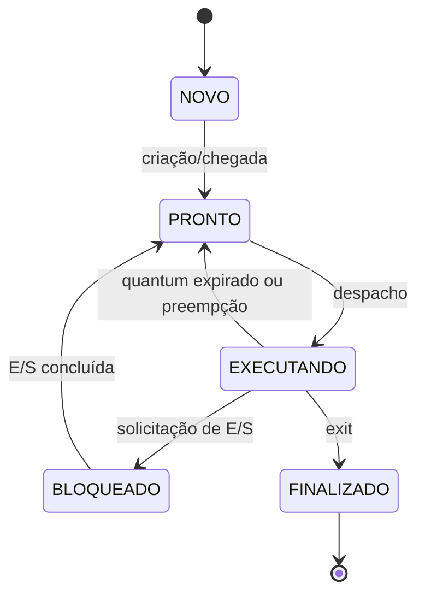

# Atividade 03 — Especificação do Gerenciamento de Processos

## 1. Visão geral e arquitetura do simulador

### 1.1 Objetivo

Nesta atividade será especificado um simulador de gerenciamento de processos de um sistema operacional. O simulador será executado em modo usuário e não substituirá o sistema operacional real do computador. A intenção é representar, de forma simplificada, como um núcleo de sistema operacional controla processos, troca o processo que utiliza a CPU e registra operações de entrada e saída.

O simulador deverá:

- criar processos a partir de um arquivo de tarefas;
- armazenar os dados de cada processo em um Bloco de Controle de Processo (PCB);
- controlar as mudanças de estado dos processos;
- selecionar processos usando diferentes algoritmos de escalonamento;
- simular surtos de CPU e operações de entrada/saída (E/S);
- produzir logs, um gráfico de Gantt textual e estatísticas ao final da execução.

### 1.2 Escopo

O projeto terá uma CPU virtual e utilizará um relógio lógico inteiro. Cada unidade do relógio representará uma unidade de tempo da simulação. Não haverá execução real das instruções dos processos nem acesso verdadeiro a dispositivos de E/S.

A primeira versão do simulador não precisa representar memória virtual, sistema de arquivos, múltiplos processadores ou comunicação entre processos.

### 1.3 Componentes principais

O simulador será dividido nos seguintes componentes:

| Componente | Responsabilidade |
|---|---|
| Leitor de tarefas | Ler e validar o arquivo de entrada e criar os processos |
| Tabela de processos | Armazenar e permitir a consulta dos PCBs |
| CPU virtual | Executar uma unidade de um surto de CPU por vez |
| Relógio lógico | Controlar o tempo total da simulação |
| Escalonador | Escolher o próximo processo da fila de prontos |
| Gerenciador de E/S | Bloquear processos e liberá-los quando a E/S terminar |
| Coletor de estatísticas | Calcular tempos, utilização da CPU e outras métricas |
| Gerador de saída | Produzir logs, Gantt textual e relatório final |

### 1.4 Hardware simulado

A CPU virtual deverá possuir:

- `PC`: contador de programa do processo em execução;
- `ACC`: registrador acumulador genérico;
- `R1` e `R2`: registradores de uso geral;
- `clock`: relógio lógico global;
- `quantumRestante`: tempo que resta da fatia atual;
- `pidEmExecucao`: PID do processo atual ou valor vazio quando a CPU estiver ociosa.

Durante uma troca de contexto, os valores de `PC`, `ACC`, `R1` e `R2` deverão ser salvos no PCB do processo interrompido. Em seguida, os registradores do próximo processo deverão ser restaurados.

### 1.5 Fluxo geral de execução

1. Ler e validar o arquivo de tarefas.
2. Criar um PCB para cada processo.
3. Avançar o relógio lógico.
4. Admitir os processos cujo tempo de chegada foi alcançado.
5. Liberar os processos que concluíram uma operação de E/S.
6. Executar uma unidade de tempo do processo atual, caso exista.
7. Verificar término do surto, pedido de E/S, término do processo ou expiração do quantum.
8. Solicitar ao escalonador outro processo quando a CPU estiver livre.
9. Registrar as transições e os intervalos do gráfico de Gantt.
10. Repetir o ciclo até todos os processos chegarem ao estado `FINALIZADO`.

## 2. Bloco de Controle de Processo e tabela de processos

### 2.1 Estrutura do PCB

Cada processo deverá possuir um PCB com os seguintes campos:

| Campo | Tipo sugerido | Descrição |
|---|---|---|
| `pid` | inteiro | Identificador único do processo |
| `nome` | texto | Nome usado para facilitar a leitura dos relatórios |
| `estado` | enumeração | Estado atual do processo |
| `tempoChegada` | inteiro | Instante em que o processo entra no sistema |
| `prioridadeBase` | inteiro | Prioridade original informada na entrada |
| `prioridadeAtual` | inteiro | Prioridade usada pelo escalonador |
| `operacoes` | lista | Sequência de surtos de CPU e E/S |
| `indiceOperacao` | inteiro | Posição da operação atual na lista |
| `tempoRestanteOperacao` | inteiro | Duração restante do surto atual |
| `pc` | inteiro | Contador de programa salvo |
| `acc`, `r1`, `r2` | inteiro | Registradores salvos |
| `tempoCPU` | inteiro | Total de tempo realmente usado na CPU |
| `tempoEspera` | inteiro | Total de tempo permanecido na fila de prontos |
| `tempoBloqueado` | inteiro | Total de tempo aguardando E/S |
| `tempoPrimeiraExecucao` | inteiro ou vazio | Momento em que o processo recebeu a CPU pela primeira vez |
| `tempoFinalizacao` | inteiro ou vazio | Momento em que o processo terminou |
| `quantidadeTrocas` | inteiro | Número de vezes que o processo entrou na CPU |

O PID deverá ser único e positivo. A tabela de processos poderá ser implementada com um mapa indexado pelo PID ou com uma lista de PCBs, desde que permita localizar um processo de forma segura.

### 2.2 Filas e coleções auxiliares

O simulador deverá manter:

- uma coleção de processos ainda não admitidos;
- uma fila de processos prontos;
- uma coleção de processos bloqueados com o instante previsto para conclusão da E/S;
- uma referência para o processo em execução;
- uma coleção de processos finalizados.

Um mesmo processo não poderá estar em duas filas ao mesmo tempo.

## 3. Ciclo de vida e transições de estado

### 3.1 Estados

Os três estados principais serão:

- `PRONTO`: o processo pode executar, mas está aguardando a CPU;
- `EXECUTANDO`: o processo está usando a CPU virtual;
- `BLOQUEADO`: o processo aguarda a conclusão de uma operação de E/S.

Também serão usados dois estados auxiliares:

- `NOVO`: o processo foi lido, mas seu tempo de chegada ainda não foi alcançado;
- `FINALIZADO`: todas as suas operações terminaram.

### 3.2 Grafo de transições



### 3.3 Regras das transições

| Evento | Origem | Destino | Ação necessária |
|---|---|---|---|
| Criação/chegada | `NOVO` | `PRONTO` | Inserir o processo na fila de prontos |
| Despacho | `PRONTO` | `EXECUTANDO` | Retirar da fila, restaurar registradores e iniciar/reiniciar o quantum |
| Expiração do quantum | `EXECUTANDO` | `PRONTO` | Salvar o contexto e reinserir no fim da fila |
| Preempção por prioridade | `EXECUTANDO` | `PRONTO` | Salvar o contexto e devolver o processo à fila |
| Solicitação de E/S | `EXECUTANDO` | `BLOQUEADO` | Salvar contexto e definir o instante de conclusão da E/S |
| E/S concluída | `BLOQUEADO` | `PRONTO` | Retirar dos bloqueados e inserir na fila de prontos |
| `exit` | `EXECUTANDO` | `FINALIZADO` | Registrar o tempo de finalização e liberar a CPU |

A criação semelhante a `fork` será apenas simulada. Na primeira versão, ela poderá ocorrer pela chegada de um processo descrito no arquivo de tarefas. Como extensão futura, uma operação `FORK` poderá criar um novo PCB durante a execução.

Quando vários eventos ocorrerem no mesmo instante, deverá ser usada esta ordem: conclusão de E/S, chegada de processos, tratamento do fim do surto ou quantum e, por último, escolha do próximo processo.

## 4. Especificação do escalonador de CPU

O algoritmo deverá ser selecionado por configuração, sem necessidade de alterar as demais partes do simulador. Todos os algoritmos receberão a fila de prontos e devolverão o PCB escolhido.

### 4.1 Round Robin

O Round Robin deverá usar uma fila do tipo FIFO e um quantum inteiro maior que zero.

Regras:

1. O processo selecionado executa até terminar seu surto de CPU, solicitar E/S, finalizar ou esgotar o quantum.
2. Se o quantum terminar e o processo ainda puder executar, ele volta para o final da fila de prontos.
3. Processos recém-criados ou liberados da E/S entram no final da fila.
4. Se não houver processo pronto, a CPU permanece ociosa e o relógio continua avançando.

### 4.2 Escalonamento por prioridade dinâmica

Será considerado que o menor valor numérico representa a maior prioridade. Por exemplo, prioridade `1` é maior que prioridade `4`.

O escalonador escolherá o processo com menor `prioridadeAtual`. Em caso de empate, será escolhido o que estiver esperando há mais tempo; se o empate continuar, será escolhido o menor PID.

Para impedir inanição, será usado envelhecimento (`aging`): a cada cinco unidades consecutivas na fila de prontos, a prioridade atual do processo melhorará em um nível, sem ficar menor que `0`.

Exemplo: um processo de prioridade `4`, depois de esperar cinco unidades, passa a ter prioridade `3`. Depois de ser escolhido, sua prioridade atual volta ao valor da prioridade base.

O modo de prioridade poderá ser preemptivo: se chegar à fila de prontos um processo com prioridade atual maior que a do processo em execução, ocorrerá uma troca de contexto no próximo limite de unidade de tempo.

### 4.3 Troca de algoritmo

A seleção será informada na configuração do simulador:

```text
algoritmo=ROUND_ROBIN
quantum=2
```

ou:

```text
algoritmo=PRIORIDADE
aging=5
preemptivo=true
```

## 5. Entrada, saída, testes e entrega

### 5.1 Arquivo de tarefas

O arquivo será textual. Linhas vazias e linhas iniciadas por `#` serão ignoradas. Cada processo ocupará uma linha no formato:

```text
PID;NOME;CHEGADA;PRIORIDADE;OPERACOES
```

As operações serão separadas por vírgulas e deverão alternar entre `CPU` e `IO`. A primeira e a última operação devem ser de CPU.

Exemplo de arquivo `tarefas.txt`:

```text
# PID;NOME;CHEGADA;PRIORIDADE;OPERACOES
1;P1;0;2;CPU:5,IO:3,CPU:2
2;P2;1;1;CPU:4
3;P3;2;4;CPU:2,IO:2,CPU:3
```

Neste exemplo, `P1` chega no tempo 0, executa cinco unidades de CPU, fica bloqueado por três unidades de E/S e retorna para executar mais duas unidades de CPU.

### 5.2 Validação da entrada

O simulador deverá rejeitar o arquivo e apresentar uma mensagem clara quando houver:

- PID repetido, nulo ou negativo;
- campo obrigatório ausente;
- tempo de chegada negativo;
- prioridade inválida;
- duração de CPU ou E/S igual ou menor que zero;
- operação desconhecida;
- duas operações de CPU ou duas operações de E/S consecutivas;
- primeira ou última operação diferente de CPU;
- algoritmo ou quantum inválido.

### 5.3 Saída esperada

Durante a execução, o simulador deverá gerar um log semelhante a:

```text
[t=0] P1: NOVO -> PRONTO (chegada)
[t=0] P1: PRONTO -> EXECUTANDO (despacho)
[t=1] P2: NOVO -> PRONTO (chegada)
[t=2] P1: EXECUTANDO -> PRONTO (quantum expirado)
[t=2] P2: PRONTO -> EXECUTANDO (despacho)
```

O gráfico de Gantt textual deverá mostrar o processo usado em cada intervalo e também os períodos ociosos:

```text
0      2      4      6
|  P1  |  P2  |  P1  |
```

Ao final, deverá ser apresentada uma tabela com, no mínimo:

- PID e nome;
- tempo de CPU;
- tempo de espera;
- tempo de retorno (`tempoFinalizacao - tempoChegada`);
- tempo de resposta (`tempoPrimeiraExecucao - tempoChegada`);
- quantidade de trocas de contexto.

Também deverão ser informadas as estatísticas gerais:

- tempo total da simulação;
- tempo ocupado e tempo ocioso da CPU;
- utilização da CPU em porcentagem;
- vazão, calculada pela quantidade de processos finalizados dividida pelo tempo total;
- médias dos tempos de espera, retorno e resposta.

### 5.4 Casos de teste

| Caso | Situação | Configuração/entrada | Resultado esperado |
|---|---|---|---|
| CT-01 | Um processo simples | P1 com `CPU:3` | P1 executa do início ao fim e a CPU tem 100% de uso |
| CT-02 | Expiração do quantum | P1 e P2 com CPU longa; RR e quantum 2 | Os processos se alternam a cada duas unidades |
| CT-03 | Operação de E/S | P1 com `CPU:2,IO:3,CPU:1` | P1 passa para bloqueado e retorna após três unidades |
| CT-04 | CPU ociosa | Primeiro processo chega no tempo 3 | Gantt mostra CPU ociosa de 0 a 3 |
| CT-05 | Prioridades diferentes | P1 prioridade 3 e P2 prioridade 1 | P2 é selecionado antes quando ambos estão prontos |
| CT-06 | Preempção | P1 executa e P2 de maior prioridade chega depois | P1 é interrompido e P2 recebe a CPU |
| CT-07 | Prevenção de inanição | Processo de baixa prioridade espera por muito tempo | O aging aumenta sua prioridade até permitir sua execução |
| CT-08 | Empate de prioridade | Dois processos com mesma prioridade | Maior espera e depois menor PID resolvem o empate |
| CT-09 | PID duplicado | Duas linhas com o mesmo PID | Arquivo rejeitado com mensagem explicativa |
| CT-10 | Quantum inválido | Round Robin com quantum 0 | Simulação não inicia e apresenta erro de configuração |
| CT-11 | Vários eventos simultâneos | Chegada e fim de E/S no mesmo instante | Eventos seguem a ordem definida e nenhum processo é perdido |
| CT-12 | Processo termina | Último surto de CPU é concluído | Processo passa a `FINALIZADO` e recebe tempo de finalização |

### 5.5 Critérios de aceitação

O simulador futuro será considerado de acordo com esta especificação quando:

1. conseguir ler corretamente o formato de entrada definido;
2. mantiver os dados e estados dos processos consistentes;
3. executar Round Robin e prioridade dinâmica de forma intercambiável;
4. simular corretamente chegada, CPU, E/S, preempção, quantum e término;
5. impedir inanição no escalonamento por prioridade;
6. gerar logs, Gantt textual e todas as estatísticas solicitadas;
7. passar pelos casos de teste definidos neste documento;
8. informar erros de entrada sem encerrar de forma inesperada.

## 6. Diretrizes para implementação futura

O código gerado a partir desta documentação deverá separar as responsabilidades em classes ou módulos. Uma sugestão é utilizar `PCB`, `ProcessTable`, `VirtualCPU`, `Scheduler`, `RoundRobinScheduler`, `PriorityScheduler`, `IOManager`, `TaskFileParser`, `Statistics` e `Simulator`.

O simulador deverá ser determinístico: com o mesmo arquivo e a mesma configuração, deverá produzir o mesmo resultado. Os componentes de escalonamento deverão seguir uma interface comum para facilitar a troca do algoritmo e a inclusão de outros no futuro.

As mensagens de erro deverão indicar a linha e o motivo do problema encontrado no arquivo. Os logs deverão permitir acompanhar toda mudança de estado e conferir manualmente o resultado dos casos de teste.


## Integrantes

- Gabriel Silveira Sales
- Ana Carolina Quintela Alves
