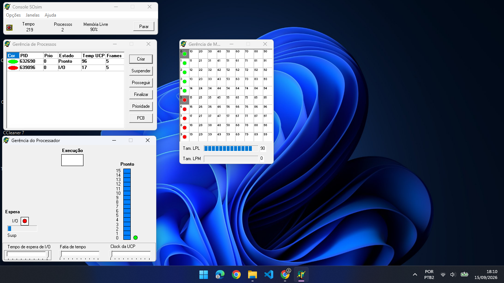

# Exercício 1: Escalonamento Circular

## 1. Configuração do Experimento
- **Algoritmo de Escalonamento:** Circular/Sem Prioridade
- **Criação de Processos:** 2 processos com a mesma prioridade (Prioridade 0)
  - **Processo CPU-bound (Cor Verde - PID 632690):** Alta demanda de uso do processador.
  - **Processo I/O-bound (Cor Vermelha - PID 639096):** Alta frequência de operações de entrada/saída (I/O).
- **Tempo de Observação:** Aproximadamente 3 minutos (Tempo final no console: 219)
- **Ambiente:** SOSIM (Simulador de Sistema Operacional)

---

## 2. Captura de Tela do Experimento

*Print da tela após 3 minutos de observação*

---

## 3. Observações e Mudanças de Estado

Conforme observado na janela **Gerência de Processos** e na simulação visual:

### Processo CPU-bound (Verde - PID 632690):
- **Estado Observado:** Alterna constantemente entre **Pronto (Ready)** e **Executando (Running)**.
- **Comportamento:** Utiliza todo o *time slice* (quantum) concedido pela UCP. Ao esgotar o quantum, sofre preempção e retorna para a fila de *Prontos*.
- **Tempo de UCP Registrado:** **96** (consome a maior parte do tempo de processamento).

### Processo I/O-bound (Vermelho - PID 639096):
- **Estado Observado:** Alterna frequentemente entre **Executando (Running)**, **Espera I/O (Waiting/Blocked)** e **Pronto (Ready)**.
- **Comportamento:** Não consome todo o seu quantum. Logo no início da execução solicita operação de I/O, liberando a UCP e indo para o estado de *Espera I/O*.
- **Tempo de UCP Registrado:** **17** (utiliza a UCP brevemente apenas para iniciar as chamadas de I/O).

---

## 4. Análise da Distribuição do Uso da UCP

- A **UCP é fortemente dominada pelo processo verde (CPU-bound)** (96 unidades de tempo vs 17 do processo vermelho).
- Como o processo vermelho (I/O-bound) se bloqueia voluntariamente para aguardar as operações de E/S, ele abre mão da UCP prematuramente.
- O processo verde aproveita quase todo o tempo remanescente da UCP, obtendo uma alocação significativamente maior.

---

## 5. Análise do Time Slice (Quantum)

### Pergunta: O que acontece se o tempo de time slice (quantum) aumentar ou diminuir?

#### A) Se o Quantum AUMENTAR:
- **Comportamento:** O sistema se aproxima do algoritmo *FIFO (First-In, First-Out)*
- **Impacto no Processo Verde (CPU-bound):** Executará por períodos mais longos sem interrupção, reduzindo a troca de contexto (*overhead*) e aumentando o seu *throughput*.
- **Impacto no Processo Vermelho (I/O-bound):** O tempo de resposta para o processo I/O-bound piora, pois ele pode ficar retido mais tempo na fila de *Prontos* esperando o processo CPU-bound terminar um quantum extenso.

#### B) Se o Quantum DIMINUIR:
- **Comportamento:** Aumenta a alternância de execução entre os processos, dando maior sensação de simultaneidade.
- **Impacto no Processo Vermelho (I/O-bound):** Melhora o tempo de resposta do processo I/O-bound e de processos interativos, pois voltam a executar mais rapidamente.
- **Impacto no Overhead de Troca de Contexto:** Aumenta significativamente as trocas de contexto. Se o quantum for extremamente pequeno, o processador gastará mais tempo salvando e restaurando registradores/contextos do que executando o trabalho útil das aplicações.

#### Conclusão do Quantum:
O valor ideal do *quantum* deve ser balanceado: grande o suficiente para minimizar o *overhead* de trocas de contexto, mas pequeno o bastante para manter o sistema responsivo a processos I/O-bound e interativos.
