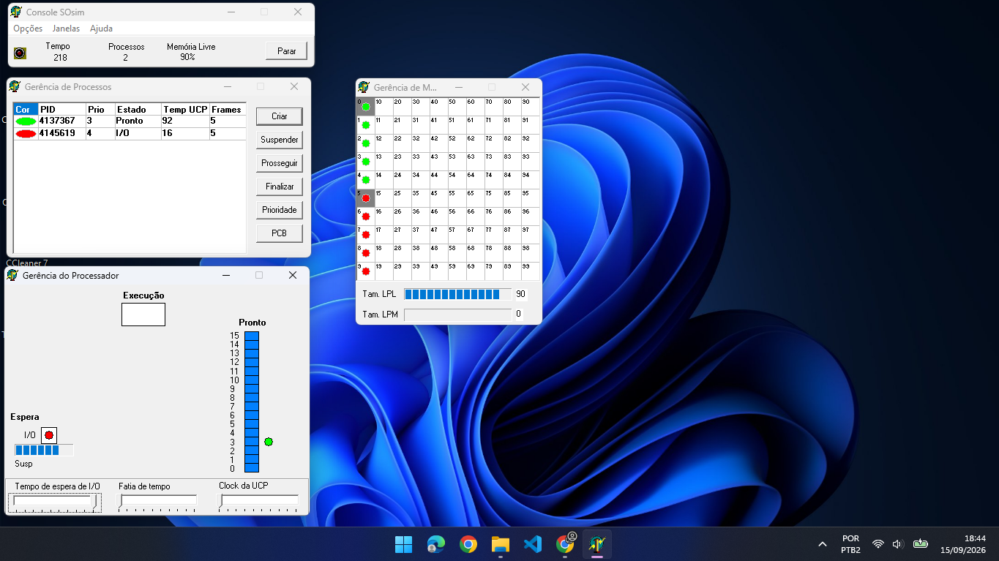

# Exercício 2: Escalonamento por Prioridades

## 1. Configuração do Experimento
- **Algoritmo de Escalonamento:** Prioridades (Com Prioridade)
- **Criação de Processos:** 2 processos com prioridades diferentes
  - **Processo CPU-bound (Cor Verde - PID 4137367):** Prioridade **3** (alta demanda de uso do processador).
  - **Processo I/O-bound (Cor Vermelha - PID 4145619):** Prioridade **4** (alta frequência de operações de entrada/saída).
- **Tempo de Observação:** Aproximadamente 3 minutos (Tempo final no console: 218)
- **Ambiente:** SOSIM (Simulador de Sistema Operacional)

---

## 2. Captura de Tela do Experimento

*Captura de tela após 3 minutos*

---

## 3. Observações e Mudanças de Estado

Conforme observado na janela **Gerência de Processos** e na simulação visual:

### Processo CPU-bound (Verde - PID 4137367 / Prioridade 3):
- **Estado Observado:** Alterna constantemente entre **Pronto (Ready)** e **Executando (Running)**.
- **Comportamento:** Devido à sua prioridade mais alta (menor valor numérico de prioridade no SOSIM), o processo obtém preferência no uso do processador sempre que está na fila de prontos.
- **Tempo de UCP Registrado:** **92** (utiliza intensamente o processador).

### Processo I/O-bound (Vermelho - PID 4145619 / Prioridade 4):
- **Estado Observado:** Alterna entre **Executando (Running)**, **Espera I/O (Waiting/Blocked)** e **Pronto (Ready)**.
- **Comportamento:** Além de interromper sua execução voluntariamente para aguardar operações de I/O, o processo possui uma prioridade menor, o que reduz seu tempo de acesso à UCP frente ao processo de maior prioridade.
- **Tempo de UCP Registrado:** **16** (baixo consumo de processamento).

---

## 4. Análise da Distribuição do Uso da UCP

- A **UCP permanece dominada pelo processo de maior prioridade (Verde - CPU-bound)** (92 unidades de tempo vs 16 do processo vermelho).
- A atribuição de prioridades acentua a diferença de tempo de CPU consumido entre os processos:
  1. O processo I/O-bound abre mão da UCP rapidamente ao solicitar operações de E/S.
  2. Ao retornar para a fila de *Prontos*, caso o processo de maior prioridade também esteja pronto, o escalonador concede a UCP prioritariamente ao processo de maior prioridade (Verde).

---

## 5. Análise do Escalonamento por Prioridades

### Pergunta: O que acontece se as prioridades forem invertidas ou alteradas dinamicamente?

#### A) Impacto da Atribuição de Prioridades:
- **Inanição (Starvation):** Se processos com prioridade mais alta forem constantemente adicionados à fila ou forem CPU-bound, processos de prioridade mais baixa podem sofrer inanição (ficar sem executar por longos períodos).
- **Mecanismo de Envelhecimento (Aging):** Para evitar a inanição de processos de menor prioridade (como o processo I/O-bound vermelho), sistemas operacionais modernos utilizam a técnica de *Aging*, aumentando gradualmente a prioridade dos processos conforme eles aguardam na fila de *Prontos*.

#### B) Comparativo I/O-bound vs. CPU-bound sob Prioridades:
- Em sistemas de tempo compartilhado ideais, costuma-se dar **prioridade mais alta para processos I/O-bound/interativos**. Como eles usam a UCP por curtos períodos antes de se bloquearem, conceder alta prioridade a eles melhora drasticamente a responsividade do sistema sem prejudicar significativamente os processos CPU-bound.
