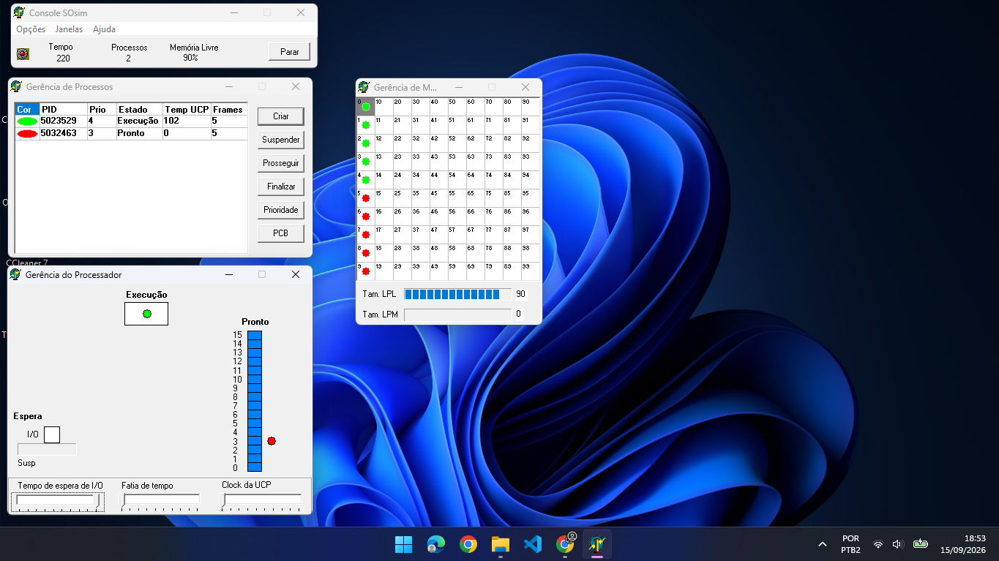

# Exercício 3: Escalonamento por Prioridades com Monopolização (Starvation)

## 1. Configuração do Experimento
- **Algoritmo de Escalonamento:** Prioridades
- **Criação de Processos:** 2 processos com prioridades diferentes
  - **Processo CPU-bound (Cor Verde - PID 5023529):** Prioridade **4** (Prioridade mais alta).
  - **Processo I/O-bound (Cor Vermelha - PID 502463):** Prioridade **3** (Prioridade mais baixa).
- **Tempo de Observação:** 3 minutos (Tempo final no console: 220)
- **Ambiente:** SOSIM (Simulador de Sistema Operacional)

---

## 2. Captura de Tela do Experimento

*Captura de tela após 3 minutos*

---

## 3. Observações e Mudanças de Estado

Conforme observado na janela **Gerência de Processos** e no diagrama de estados do processador após os 3 minutos:

### Processo CPU-bound (Verde - PID 5023529 / Prioridade 4):
- **Estado Observado:** Permanece continuamente no estado **Execução (Running)**.
- **Comportamento:** Como possui a maior prioridade e não realiza chamadas de I/O, ele monopoliza a UCP e executa ininterruptamente durante todo o período sem sofrer preempção.
- **Tempo de UCP Registrado:** **102** (monopolizou 100% do tempo de processamento).

### Processo I/O-bound (Vermelho - PID 502463 / Prioridade 3):
- **Estado Observado:** Permanece retido no estado **Pronto (Ready)**.
- **Comportamento:** Por ter prioridade menor e estar concorrendo com um processo CPU-bound de maior prioridade, ele sequer ganha a UCP uma única vez para conseguir disparar sua operação de entrada/saída.
- **Tempo de UCP Registrado:** **0** (não executou nenhuma instrução durante os 3 minutos).

---

## 4. Análise da Distribuição do Uso da UCP

- O uso da UCP foi **100% alocado para o processo CPU-bound verde (PID 5023529)**.
- O **processo I/O-bound vermelho (PID 502463)** sofreu o fenômeno de **Starvation (Inanição)**, onde um processo pronto para executar fica privado do uso da UCP por tempo indeterminado devido à presença contínua de um processo de maior prioridade que monopoliza o processador.

---

## 5. Análise do Problema da Inanição (Starvation)

### Pergunta: O que o sistema operacional deve fazer para resolver a inanição (starvation) de processos de menor prioridade?

#### A) Implementação do Mecanismo de Aging (Envelhecimento):
- Para impedir que processos de baixa prioridade fiquem presos no estado *Pronto* sem conseguir executar (mesmo os I/O-bound), o sistema operacional deve aumentar gradualmente a prioridade dos processos conforme o tempo de espera na fila de prontos aumenta.
- Assim que a prioridade do processo vermelho for elevada até superar a do processo verde, o escalonador concederá a UCP a ele para que possa rodar e disparar suas requisições de I/O.

#### B) Priorização de Processos I/O-bound:
- Em sistemas operacionais reais, é comum conceder **prioridades mais altas (ou dinamicamente ajustadas)** para processos I/O-bound, pois eles usam a UCP rapidamente e liberam o processador logo em seguida, mantendo a responsividade do sistema sem prejudicar os processos CPU-bound.
