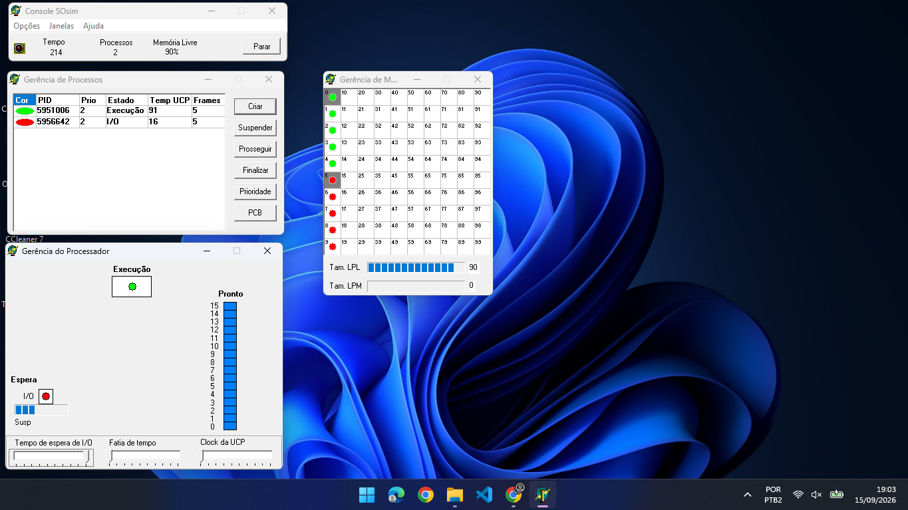

# Exercício 4: Escalonamento por Prioridades Iguais (Empate de Prioridade)

## 1. Configuração do Experimento
- **Algoritmo de Escalonamento:** Prioridades (Com Prioridade)
- **Criação de Processos:** 2 processos com a mesma prioridade
  - **Processo CPU-bound (Cor Verde - PID 5951006):** Prioridade **2** (alta demanda de uso do processador).
  - **Processo I/O-bound (Cor Vermelha - PID 5956642):** Prioridade **2** (alta frequência de operações de entrada/saída).
- **Tempo de Observação:** Aproximadamente 3 minutos (Tempo final no console: 214)
- **Ambiente:** SOSIM (Simulador de Sistema Operacional)

---

## 2. Captura de Tela do Experimento

*Captura de tela após 3 minutos*

---

## 3. Observações e Mudanças de Estado

Conforme observado na janela **Gerência de Processos** e nos diagramas de estado após os 3 minutos:

### Processo CPU-bound (Verde - PID 5951006 / Prioridade 2):
- **Estado Observado:** Alterna entre **Pronto (Ready)** e **Execução (Running)**.
- **Comportamento:** Como possui prioridade idêntica ao processo vermelho, ele divide o escalonador por *fatia de tempo (Round-Robin)* no seu nível de prioridade, aproveitando integralmente os *time slices* disponibilizados.
- **Tempo de UCP Registrado:** **91** (consome a ampla maioria dos ciclos de processamento).

### Processo I/O-bound (Vermelho - PID 5956642 / Prioridade 2):
- **Estado Observado:** Alterna frequentemente entre **Executando (Running)**, **Espera I/O (Waiting/Blocked)** e **Pronto (Ready)**.
- **Comportamento:** Mesmo tendo a mesma prioridade do processo verde, abre mão voluntariamente da UCP logo no início de seu quantum para aguardar as operações de E/S.
- **Tempo de UCP Registrado:** **16** (baixo tempo total de CPU, usado essencialmente para iniciar requisições de I/O).

---

## 4. Análise da Distribuição do Uso da UCP

- O **processo verde (CPU-bound)** consome significativamente mais tempo de processador (**91 vs 16**) mesmo com prioridades idênticas.
- Em cenários de **empate de prioridade**, o algoritmo utiliza o critério circular (*Round-Robin*) para desempate. 
- Contudo, como o processo vermelho (I/O-bound) cede a UCP rapidamente ao fazer requisições de E/S, o processo verde acaba ocupando quase a totalidade do tempo restante na fila de *Prontos*.

---

## 5. Análise do Perfil de Processos I/O-bound

### Pergunta: Qual a vantagem desse escalonamento em processos I/O-bound de perfis diferentes?

#### Resposta:
- **Maximização do Paralelismo de E/S:** Processos I/O-bound de perfis diferentes solicitam recursos distintos (ex: disco, rede, teclado). O escalonamento permite que a UCP processe rapidamente a chamada inicial de cada um e os coloque em espera, fazendo com que múltiplos periféricos trabalhem simultaneamente em segundo plano.
- **Liberação Precoce da UCP:** Como processos I/O-bound usam apenas o início do seu *quantum* e se bloqueiam voluntariamente, eles não monopolizam a UCP. O escalonador consegue alternar entre eles quase instantaneamente, garantindo baixa latência para todos os perfis.
- **Eficiência e Responsividade:** Evita que a UCP e os dispositivos de E/S fiquem ociosos, otimizando o *throughput* global do sistema e mantendo a interface gráfica e tarefas interativas responsivas.
