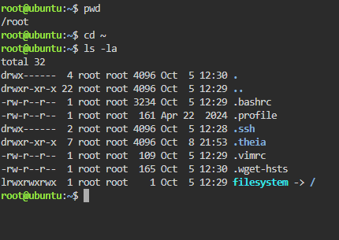
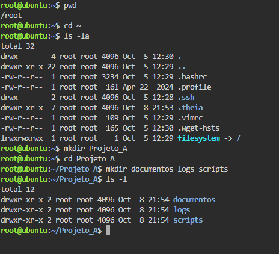
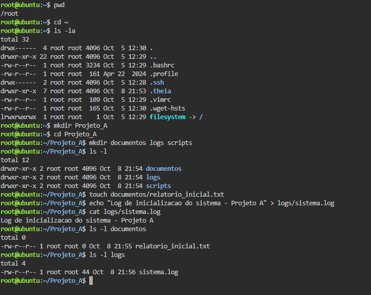
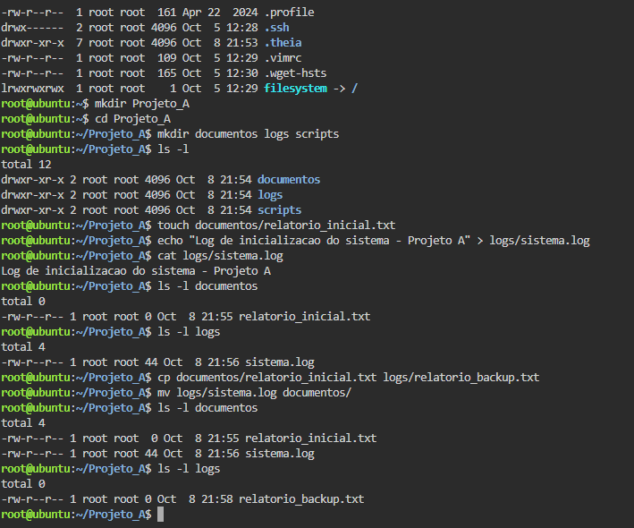
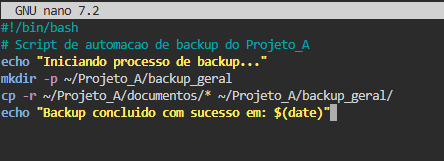
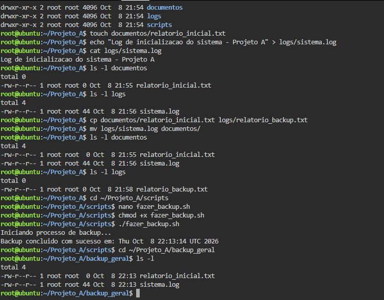

# Atividade 06 — Gerenciamento de Arquivos e Diretórios Linux

## Objetivo

Este exercício prático aborda o gerenciamento de arquivos e diretórios em ambiente Linux, cobrindo navegação, manipulação de arquivos, cópia, movimentação e automação por meio de Shell Script.

## Cenário do Exercício

Foi simulada a atuação de um administrador de sistemas responsável pela organização do **Projeto_A**.

Durante a atividade foram realizadas as seguintes tarefas:

- Navegação pelo sistema de arquivos Linux;
- Criação de diretórios;
- Criação e manipulação de arquivos;
- Cópia e movimentação de arquivos;
- Desenvolvimento de um Shell Script;
- Execução de uma rotina de backup;
- Verificação dos arquivos gerados pelo backup.

A atividade foi executada utilizando o ambiente **Ubuntu disponibilizado pelo KillerCoda**.

---

# Etapa 1 — Navegação e Inspeção do Ambiente

Antes de criar qualquer pasta, foi verificado o diretório atual de trabalho e, em seguida, acessado o diretório pessoal do usuário.

### Comandos utilizados

pwd cd ~ ls -la

O comando `pwd` apresentou:

/root

Como o usuário utilizado no ambiente era `root`, o diretório pessoal corresponde a `/root`.

O comando `ls -la` foi utilizado para visualizar o conteúdo do diretório, incluindo arquivos e diretórios ocultos.

### Evidência

---

# Etapa 2 — Criação da Estrutura de Diretórios

Foi criado o diretório principal `Projeto_A` e, dentro dele, os diretórios:

- `documentos`
- `logs`
- `scripts`

### Comandos utilizados

mkdir ProjetoA cd ProjetoA mkdir documentos logs scripts ls -l

A estrutura criada foi:

Projeto_A/ ├── documentos/ ├── logs/ └── scripts/

O comando `mkdir` foi utilizado para criar os diretórios e o comando `ls -l` para verificar a estrutura criada.

### Evidência

---

# Etapa 3 — Criação e Edição de Arquivos de Texto

Nesta etapa foram criados os arquivos necessários para o projeto.

Primeiramente, foi criado um arquivo vazio chamado `relatorio_inicial.txt` dentro do diretório `documentos`.

Em seguida, foi criado o arquivo `sistema.log` dentro do diretório `logs`, contendo uma mensagem de inicialização do sistema.

### Comandos utilizados

touch documentos/relatorio_inicial.txt echo "Log de inicialização do sistema - Projeto A" > logs/sistema.log cat logs/sistema.log

O comando `touch` foi utilizado para criar o arquivo vazio.

O comando `echo`, juntamente com o operador `>`, foi utilizado para gravar a mensagem no arquivo `sistema.log`.

O comando `cat` foi utilizado para visualizar o conteúdo do arquivo.

O conteúdo registrado foi:

Log de inicialização do sistema - Projeto A

### Resultado

Os arquivos criados foram:

documentos/ └── relatorio_inicial.txt

logs/ └── sistema.log

### Evidência

---

# Etapa 4 — Cópia e Movimentação de Arquivos

Nesta etapa foi realizada a cópia do arquivo `relatorio_inicial.txt` para o diretório `logs`.

A cópia recebeu o nome `relatorio_backup.txt`.

Em seguida, o arquivo `sistema.log` foi movido do diretório `logs` para o diretório `documentos`.

### Comandos utilizados

cp documentos/relatorioinicial.txt logs/relatoriobackup.txt mv logs/sistema.log documentos/ ls -l documentos ls -l logs

O comando `cp` foi utilizado para duplicar o arquivo `relatorio_inicial.txt`.

O comando `mv` foi utilizado para mover o arquivo `sistema.log`.

### Estrutura após a operação

ProjetoA/ ├── documentos/ │ ├── relatorioinicial.txt │ └── sistema.log ├── logs/ │ └── relatorio_backup.txt └── scripts/

### Evidência

---

# Etapa 5 — Criação e Execução de um Script Shell

Nesta etapa foi desenvolvido um Shell Script para automatizar a realização do backup dos arquivos existentes no diretório `documentos`.

O script foi criado dentro do diretório `scripts` com o nome:

fazer_backup.sh

### Criação do script

Foi utilizado o editor `nano`:

cd ~/ProjetoA/scripts nano fazerbackup.sh

O conteúdo do script foi:

#!/bin/bash

Script de automação de backup do Projeto_A
echo "Iniciando o processo de backup..." mkdir -p ~/ProjetoA/backupgeral cp -r ~/ProjetoA/documentos/ ~/ProjetoA/backupgeral/ echo "Backup concluído com sucesso em: $(date)"

### Permissão de execução

Após a criação do arquivo, foi adicionada a permissão de execução:

chmod +x fazer_backup.sh

### Execução

O script foi executado utilizando:

./fazer_backup.sh

A execução apresentou uma mensagem indicando o início do processo de backup e, posteriormente, a conclusão da operação.

O script criou automaticamente o diretório:

~/ProjetoA/backupgeral

e copiou para ele os arquivos existentes no diretório `documentos`.

### Evidência

---

# Etapa 6 — Verificação do Backup

Após a execução do Shell Script, foi realizada a verificação do diretório de backup.

### Comandos utilizados

cd ~/ProjetoA/backupgeral ls -l

O resultado apresentou os seguintes arquivos:

relatorio_inicial.txt sistema.log

Isso confirma que o script realizou corretamente a cópia dos arquivos existentes no diretório `documentos`.

### Estrutura final do projeto

ProjetoA/ ├── documentos/ │ ├── relatorioinicial.txt │ └── sistema.log │ ├── logs/ │ └── relatoriobackup.txt │ ├── scripts/ │ └── fazerbackup.sh │ └── backupgeral/ ├── relatorioinicial.txt └── sistema.log

### Evidência

---

# Conclusão

A atividade permitiu aplicar, de forma prática, conceitos fundamentais de gerenciamento de arquivos e diretórios no sistema operacional Linux.

Foram utilizados comandos para:

- Identificar o diretório atual com `pwd`;
- Navegar pelo sistema com `cd`;
- Listar arquivos com `ls`;
- Criar diretórios com `mkdir`;
- Criar arquivos com `touch`;
- Inserir conteúdo com `echo`;
- Visualizar arquivos com `cat`;
- Copiar arquivos com `cp`;
- Mover arquivos com `mv`;
- Alterar permissões com `chmod`;
- Criar e executar Shell Scripts;
- Automatizar uma rotina de backup.

Ao final da atividade, foi possível verificar que o script `fazer_backup.sh` criou o diretório `backup_geral` e realizou corretamente a cópia dos arquivos do diretório `documentos`.
